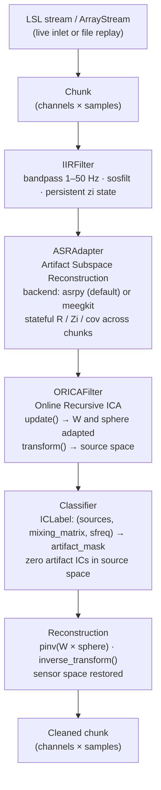
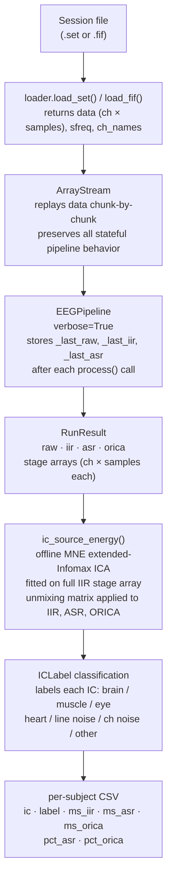
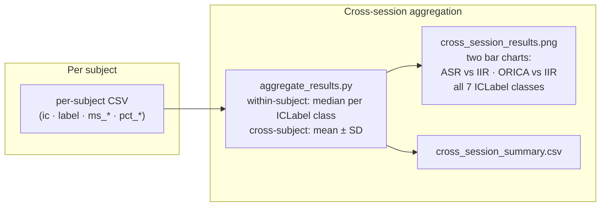

# Pipeline Architecture

Two diagrams below describe pyorica's architecture. The first covers the real-time processing path; the second covers the evaluation framework used to benchmark results offline.

---

## 1. Real-time pipeline

Each chunk of EEG data flows through five sequential stages. All state (filter coefficients, ASR calibration, ORICA weights) persists across chunks.

**Key invariants**

| Stage | Input shape | Output shape | State |
|-------|-------------|--------------|-------|
| IIRFilter | (ch, samples) | (ch, samples) | filter zi per channel |
| ASRAdapter | (ch, samples) | (ch, samples) | R, Zi, cov (asrpy) |
| ORICAFilter | (ch, samples) | (ch, components) | W, sphere |
| Classifier | (comp, samples) | bool mask (comp,) | none |
| Reconstruction | (comp, samples) | (ch, samples) | none |

---

## 2. Evaluation framework

The evaluation framework replays a session file in **simulated real-time** — using the same stateful pipeline code path as a live stream — then performs an offline ICA analysis to measure per-IC artifact energy reduction.

**Design note**: The offline ICA in `ic_source_energy()` is a separate measurement tool — it uses a stable MNE ICA decomposition fitted on the IIR stage, *not* the online ORICA weights. This ensures the metric is independent of ORICA's convergence state and gives a reproducible ground-truth comparison across pipeline stages.

---

## Correspondence to original ORICA pipeline

| Aspect | Original ORICA (`receiver.py`) | pyorica |
|--------|-------------------------------|---------|
| ASR backend | `EEG_ASR_BACKEND=asrpy` (reference) | `PipelineConfig.asr_backend="asrpy"` |
| ASR cutoff | `EEG_ASR_CUTOFF=20` | `PipelineConfig.asr_cutoff=20.0` |
| Calibration window | first 2 min of session IIR-filtered | `PipelineConfig.asr_calibration_seconds=120.0` |
| ICLabel threshold | `EEG_ICALABEL_THRESHOLD=0.7` | `PipelineConfig.icalabel_threshold=0.7` |
| Pipeline order | IIR → notch → ASR → ORICA | IIR → ASR → ORICA (notch folded into IIR h_freq) |

All reference-experiment parameters are captured in `PipelineConfig` defaults and serialized to `config.yaml` alongside each benchmark output.
